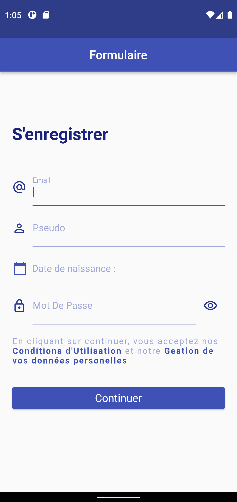
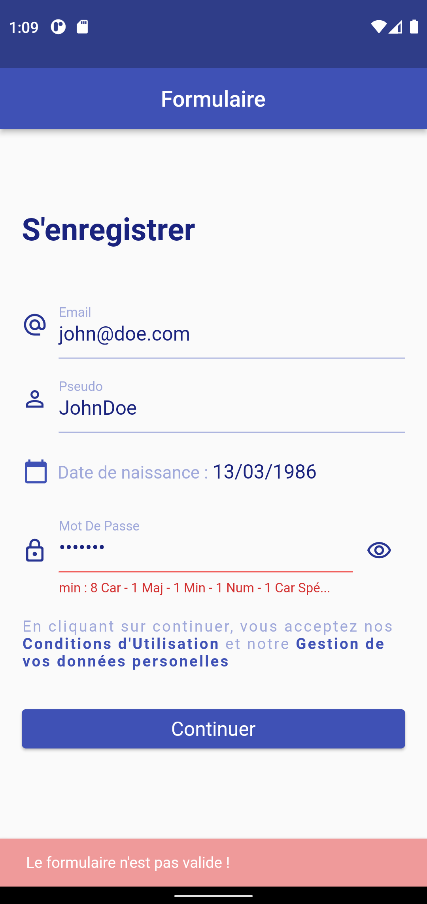

# About Sign Up Form Screen

This is a connection screen, I've made to practice with forms in Flutter apps.

I use TextFormField with <strong>Validators, DatePicker and SnackBar</strong>.

## Getting Started

To get a local copy up and running follow these simple steps.

### Prerequisites

you need a complete version of flutter installed on your computer and an emulator of ios or android device.

### Install
Clone this repo : https://github.com/menel972/signup-form-flutter.git

run :

$ flutter pub get

$ flutter run
